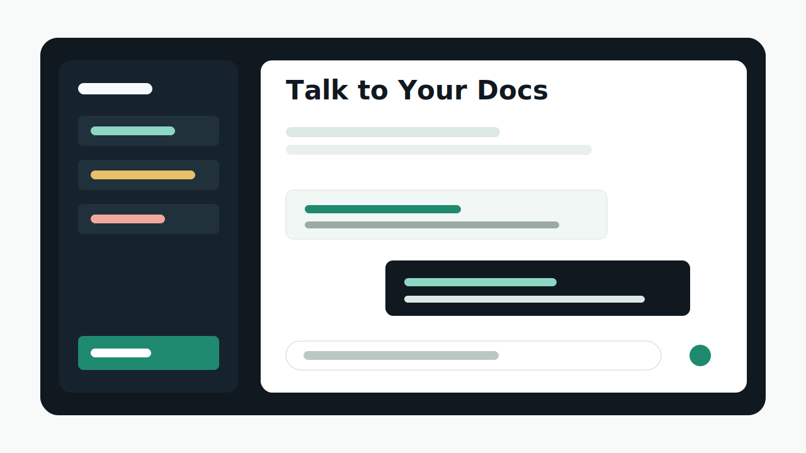
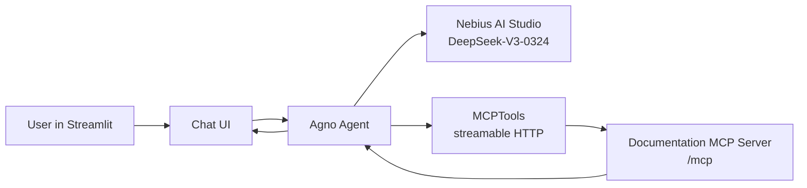

# Talk to Your Docs

Turn any MCP-enabled documentation site into a conversational assistant.

Talk to Your Docs is a Streamlit-based documentation Q&A agent powered by the Agno framework, Model Context Protocol tools, and Nebius AI. Add your Nebius API key, point the app at a documentation URL, and ask natural-language questions. The agent connects to the hosted docs MCP server, searches the source material, reads the relevant pages, and answers with practical context.



## Why this project is useful

Most documentation is still designed for browsing. That works when you know exactly what to look for, but it gets slow when you are migrating platforms, comparing features, debugging setup, or trying to understand a new API quickly.

Talk to Your Docs gives documentation a chat interface while keeping answers grounded in the source docs. It is especially useful for developer documentation hosted on platforms that expose an MCP endpoint, including Mintlify-style `/mcp` search servers.

## Features

- **AI-powered documentation chat** using Nebius AI and the DeepSeek-V3-0324 model by default.
- **MCP integration** through Agno's `MCPTools` with streamable HTTP transport.
- **Flexible documentation sources** with any public MCP-enabled docs URL or direct `/mcp` endpoint.
- **Interactive Streamlit interface** with chat history, example prompts, and a clean sidebar configuration flow.
- **Secure API key handling** through Streamlit session input, local `.env`, or hosted secrets.
- **Deployment-ready structure** for Streamlit Community Cloud, Render, Railway, or any Python web host.

## Tech stack

- **Streamlit** for the web app interface
- **Agno** for agent orchestration
- **MCP Tools** for documentation search and retrieval
- **Nebius AI Studio** for OpenAI-compatible model inference
- **DeepSeek-V3-0324** as the default model
- **GitHub Pages** for the public project website

## Setup

### 1. Install dependencies

```bash
uv sync
```

If you do not have `uv` installed, install it first:

```bash
pip install uv
```

You can also use pip:

```bash
python -m venv .venv
.venv\Scripts\activate
pip install -r requirements.txt
```

### 2. Set up environment variables

Create a `.env` file with your Nebius API key:

```env
NEBIUS_API_KEY=your_nebius_api_key_here
```

You can also paste the key directly into the Streamlit sidebar at runtime. Do not commit real API keys.

### 3. Run the application

```bash
uv run streamlit run main.py
```

Or with pip:

```bash
streamlit run main.py
```

## How to use

1. Open the Streamlit app.
2. Enter your Nebius API key in the sidebar.
3. Set the documentation URL. The default is `https://mintlify.com/docs`.
4. Ask a question in the chat input.
5. Use the example questions in the sidebar for quick starts.

If you enter `https://mintlify.com/docs`, the app automatically connects to `https://mintlify.com/docs/mcp`. If you already have a direct endpoint such as `https://docs.agno.com/mcp`, the app uses it as-is.

## Example questions

- How do I migrate documentation from my current platform to Mintlify?
- What are the key AI-native documentation features?
- How do I set up authentication?
- What are the best practices for documentation?

## Architecture



## Deployment

### Streamlit Community Cloud

1. Push this repository to GitHub.
2. Create a new Streamlit app from the repository.
3. Set `main.py` as the entrypoint.
4. Add `NEBIUS_API_KEY` as a Streamlit secret if you do not want users to paste their own key.
5. Deploy.

### Render or Railway

Use this start command:

```bash
streamlit run main.py --server.port $PORT --server.address 0.0.0.0
```

Add `NEBIUS_API_KEY` as an environment variable in the hosting dashboard.

## Project structure

```text
.
├── main.py                         # Streamlit UI
├── src/talk_to_your_docs/agent.py  # Agno + Nebius + MCP agent logic
├── tests/                          # Helper tests
├── site/                           # Published GitHub Pages website
├── pyproject.toml                  # uv project config
├── requirements.txt                # pip/Streamlit Cloud dependencies
└── .env.example                    # local environment template
```

## Notes

- The app expects the documentation source to expose an MCP server.
- Public Mintlify docs expose a search MCP server at the `/mcp` path.
- Authenticated docs may require an authenticated MCP endpoint and additional headers, which are not enabled in this starter app.

## License

MIT License.

